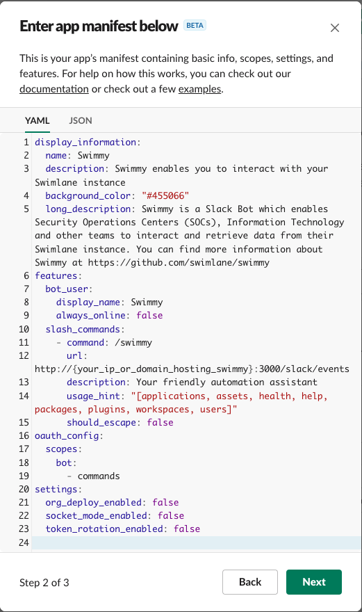

# Swimmy


Swimmy is a [Swimlane](https://swimlane.com) Slack bot written in Python to interact with your Swimlane instance.

Currently Swimmy has the following capabilities:

* workspaces, assets, applications, plugins, packages, users, health, help
* search [search_string] # typically an IOC
* get record [tracking_id]
* get [acronym] tasks
* create [acronym] record

> When using the search command Swimmy is configured to return the first {Config.search_results_max_results} results.

## Getting Started 

In order to use **Swimmy** you will need to [create a Slack application](#creating-a-slack-application) and [gather authentication credentials for Swimlane](#swimlane-setup).

You will need, at a minimum, the following before you can setup **Swimmy**:

* Slack bot token
* Slack bot signing secret
* Swimlane hostname
* Swimlany authentication credentials
    * Swimlane Personal Access Token with access to call the Swimlane API or
    * Swimlane username and password for an account that can call the Swimlane API

Once you have gathered these values you must create a `.env` including these (and other) [configuration settings](#configuration-settings)

### Creating a Slack Application 

The first step is to edit the provided [Slack Application Manifest](swimmy.slack.manifest.yml). The only piece you will need to modify is the location where Swimmy is running (including port). 

The url must be in the following format:

`https://{your_ip_or_domain}:3000/slack/events`

> Please note that currently it requires the address to have https. Please make sure that your address has this in the manifest. After it is upload you can modify this back to http in the `Slash Commands` section of the application.

Once you have edited the manifest then navigate to this page [Slack Application](https://api.slack.com/apps) to create an application for Slcak. 

Select `Create New App` and select `From an app manifest` and copy your edited manifest into the manifest window.


Then select the correct environment to add Swimmy and select `Next`


Copy your edited manifest into the manifest window.



Review the OAuth scopes and select `Create`.


Next install your app to the selected workspace by selecting `Install to Workspace`


After installing Swimmy you then need to scroll down and save the `Signing Secret` value in a safe place. We will be using this when we deploy Swimmy.


Next select the `OAuth & Permissions` section under `Features`.  You may have to select `Generate Tokens`. Please do that now and then capture the `Bot User OAuth Token`. We will be using this when we deploy Swimmy.


That is it! 

### Additional Steps

If you modified the URL to your environment in the Slack manifest with https then we need to do one more thing.

Go to the `Slash Commands` section under `Features`


And click the pencil to edit your `/swimmy` slash command. When prompted edit the URL back to http and click save.


Now your are done!

### Swimlane Setup

The first thing you need in order to use Swimmy is a set of credentials to access the Swimlane API. You will need authentication credentials for your Swimlane instance. This can be a `Personal Access Token` (recommended) or `username` and `password` with API access to your Swimlane instance.

If you are using a Swimlane instance that is Docker based (deployed using docker-compose) then you can use the provided [docker-compose.override.yml](docker-compose.override.yml) file. 

Additionally, this [docker-compose.override.yml](docker-compose.override.yml) file expects that swimmy is located at `/opt/swimmy`.

To do so you must first copy or clone the Swimmy repository to 

```
/opt/swimmy
```

Next you will need to copy the  [docker-compose.override.yml](docker-compose.override.yml) to `/opt/swimlane/docker-compose.override.yml`. You will also need to copy your `.env` file to `/opt/swimlane/.env`. Once this is done then you can stand up your Swimlane instance running `docker-compose up -d`


### Prerequisites

In order to use this bot you will need to make sure you have cloned the repository and made a copy of swimmy's configuration file. 

```bash
git clone https://github.com/swimlane/swimmy.git
cd swimmy
cp .env.example .env
```

### Configuration Settings

The following are the avialble list of configuration settings for **Swimmy**. In order to use this project you must copy the [.env.example](.env.example) file and create a new `.env` file. Next you will need to update this `.env` file with your configuration values.

Update the `.env` file with your tokens and credentials.

```text
SLACK_BOT_TOKEN=some_token
SLACK_BOT_SIGNING_SECRET=some_signing_secret

SWIMLANE_HOST=https://my.orgs.swimlane.instance 
SWIMLANE_USERNAME=username
SWIMLANE_PASSWORD=some_password
#SWIMLANE_ACCESS_TOKEN=or_some_access_token
SWIMLANE_VERIFY_SSL="False"
#SWIMLANE_VERIFY_SERVER_VERSION="False"
#SWIMLANE_DEFAULT_TIMEOUT=300
#SWIMLANE_RESOURCE_CACHE_SIZE=0
#SWIMLANE_WRITE_TO_READ_OLNLY="False"

SWIMLANE_SEARCH_RESULTS_MAX_RESULTS=10
```

### Deployment

To begin running this project simply run:

```
docker-compose up 
```

## Built With

* [carcass](https://github.com/MSAdministrator/carcass) - Python packaging template

## Contributing

Please read [CONTRIBUTING.md](CONTRIBUTING.md) for details on our code of conduct, and the process for submitting pull requests to us.

## Versioning

We use [SemVer](http://semver.org/) for versioning. 

## Authors

* Josh Rickard - *Initial work* - [MSAdministrator](https://github.com/MSAdministrator)
* Nick Tausek - *Swimmy Logo Concept* [nikkuman](https://github.com/nikkuman)

See also the list of [contributors](https://github.com/swimlane/swimmy/contributors) who participated in this project.

## License

This project is licensed under the MIT License - see the [LICENSE](LICENSE.md) file for details
